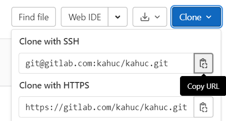

# Configurar o GIT

## Passo 1:
Instalar GIT e linkar a conta de gitlab:

- [Tutorial de Instalação e SSH keys](https://www.youtube.com/watch?v=iXuIp5uNnLk)

- [DOWNLOAD do GIT](https://git-scm.com/download/win)

> **NOTA:**
> Na parte "**Chosing the default editor used by git**" selecionar *vscode* ou o editor que usam.

## Passo 2:
Numa pasta pretendida, clonar o repositório KahUC fazendo`git clone {ssh}`

Endereço SSH do repositório:

